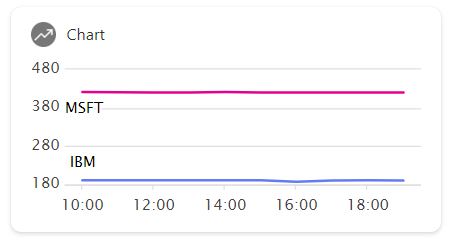
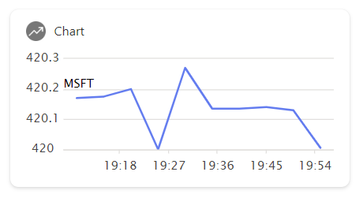
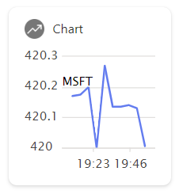

# basic-chart-ace

## Summary

This is a basic Adaptive Card Extensions that shows how to use the new LineChartCardView component to display a simple line chart.

## Used SharePoint Framework Version

## Applies to

- [SharePoint Framework](https://aka.ms/spfx)
- [Microsoft 365 tenant](https://docs.microsoft.com/en-us/sharepoint/dev/spfx/set-up-your-developer-tenant)

> Get your own free development tenant by subscribing to [Microsoft 365 developer program](http://aka.ms/o365devprogram)

## Prerequisites

> Any special pre-requisites?

## Solution

| Solution    | Author(s)                                               |
| ----------- | ------------------------------------------------------- |
| BasicChartACE | [GuidoZam](https://github.com/guidozam) |

## Version history

| Version | Date             | Comments        |
| ------- | ---------------- | --------------- |
| 1.0     | April 1, 2024 | Initial release |
| 1.1     | June 16, 2024 | Updated SPFx version |

## Disclaimer

**THIS CODE IS PROVIDED _AS IS_ WITHOUT WARRANTY OF ANY KIND, EITHER EXPRESS OR IMPLIED, INCLUDING ANY IMPLIED WARRANTIES OF FITNESS FOR A PARTICULAR PURPOSE, MERCHANTABILITY, OR NON-INFRINGEMENT.**

---

## Minimal Path to Awesome

- Clone this repository
- Ensure that you are at the solution folder
- in the command-line run:
  - **npm install**
  - **gulp serve**

## Features

Sample SharePoint Framework Adaptive Card Extension that shows how to use the new LineChartCardView component to display a simple line chart.

This sample illustrates how to use the `cardViewParameters()` method that returns the new  `IDataVisualizationCardViewParameters` and how to instantiate the data series used by the new `LineChartCardView` component.

>In this sample the stock data will be retrieved from the [Alpha Vantage API](https://www.alphavantage.co/documentation/), you can claim your free API key [here](https://www.alphavantage.co/support/#api-key), remember that the free key has a limit of __25 requests per day__.

## References

- [Getting started with SharePoint Framework](https://docs.microsoft.com/en-us/sharepoint/dev/spfx/set-up-your-developer-tenant)
- [Microsoft 365 Patterns and Practices](https://aka.ms/m365pnp) - Guidance, tooling, samples and open-source controls for your Microsoft 365 development
