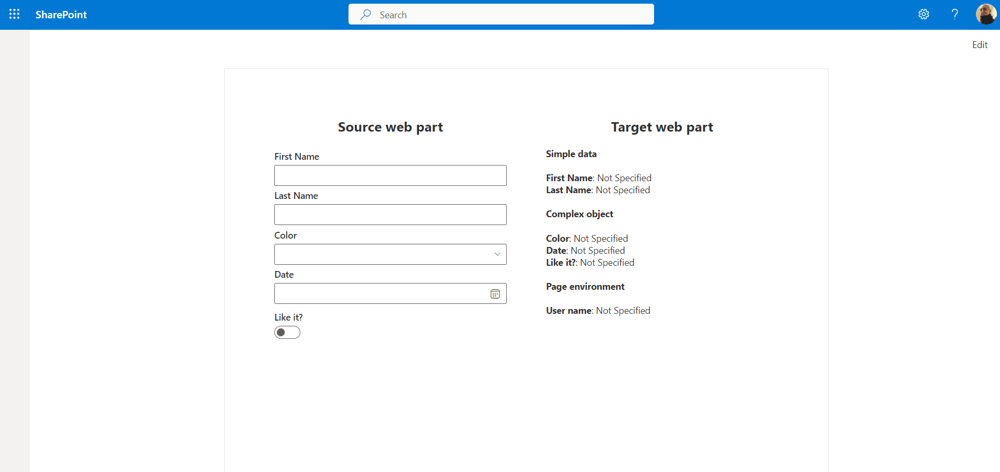
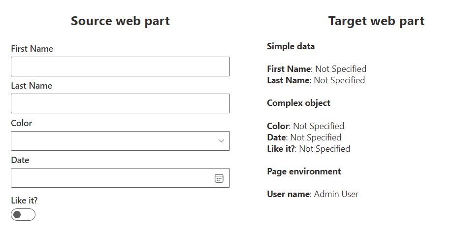
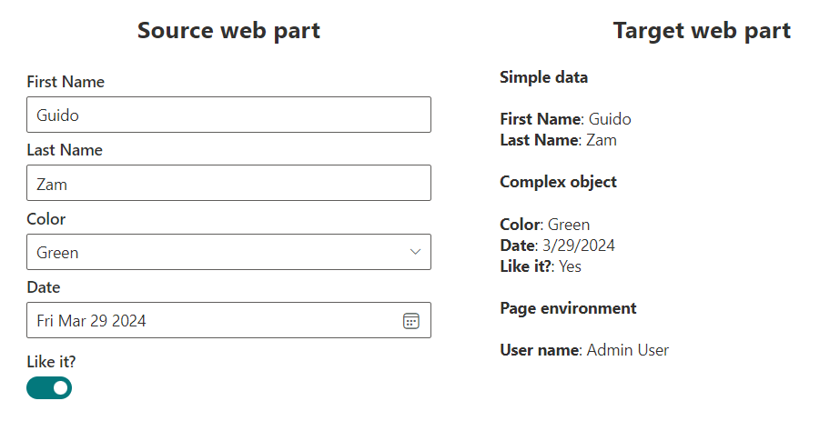

# connected-web-parts

## Summary

This samples showcase how to connect two web parts together.








## Compatibility

| :warning: Important |
|:---------------------------|
| Every SPFx version is optimally compatible with specific versions of Node.js. In order to be able to build this sample, you need to ensure that the version of Node on your workstation matches one of the versions listed in this section. This sample will not work on a different version of Node.|
|Refer to <https://aka.ms/spfx-matrix> for more information on SPFx compatibility.   |

This sample is optimally compatible with the following environment configuration:


-Incompatible-red.svg "SharePoint Server 2016 Feature Pack 2 requires SPFx 1.1")


## Used SharePoint Framework Version


## Applies to

* [SharePoint Framework](https://learn.microsoft.com/sharepoint/dev/spfx/sharepoint-framework-overview)
* [Microsoft 365 tenant](https://learn.microsoft.com/sharepoint/dev/spfx/set-up-your-development-environment)

> Get your own free development tenant by subscribing to [Microsoft 365 developer program](http://aka.ms/o365devprogram)


## Contributors
<!--
We use this section to recognize and promote your contributions. Please provide one author per line -- even if you worked together on it.

We'll only use the info you provided here. Make sure to include your full name, not just your GitHub username.

Provide a link to your GitHub profile to help others find more cool things you have done. The only link we'll accept is a link to your GitHub profile.

If you want to provide links to your social media, blog, and employer name, make sure to update your GitHub profile.
-->

* [Guido Zambarda](https://github.com/guidozam)

## Version history

Version|Date|Comments
-------|----|--------
|1.0|March 16, 2024|Initial release|

## Prerequisites

<!--
Any special pre-requisites? Include any lists, permissions, offerings to the demo gods, or whatever else needs to be done for this web part to work.

Please describe the steps to configure the pre-requisites. Feel free to add screen shots, but make sure that there is a text description of the steps to perform.
 
-->
## Minimal path to awesome

* Clone this repository (or [download this solution as a .ZIP file](https://pnp.github.io/download-partial/?url=https://github.com/pnp/sp-dev-fx-webparts/tree/main/samples/react-connected-web-parts) then unzip it)
* From your command line, change your current directory to the directory containing this sample (`react-connected-web-parts`, located under `samples`)
* in the command line run:
  * `npm install`
  * `gulp serve`

> This sample can also be opened with [VS Code Remote Development](https://code.visualstudio.com/docs/remote/remote-overview). Visit <https://aka.ms/spfx-devcontainer> for further instructions.

## Features

This sample illustrates how to use the `IDynamicDataCallables` interface to connect two web parts together. The first web part is a provider, and the second web part is a consumer. The provider has no configuration in the property pane, the consumer instead has properties in the property pane that allow the user to select the provider web part and the specific property to bind.

The `IDynamicDataCallables` interface define the methods that the provider web part must implement to expose its properties to the consumer web part.

One of the required methods in the provider web part is the following:
  
```typescript
public getPropertyDefinitions(): ReadonlyArray<IDynamicDataPropertyDefinition> {
  return [
    {
      id: Constants.FirstNamePropertyId,
      title: strings.FirstName,
    },
    {
      id: Constants.LastNamePropertyId,
      title: strings.LastName,
    },
    {
      id: Constants.PreferencesPropertyId,
      title: strings.Preferences,
    },
  ];
}
```
This define the properties that the provider web part exposes to the consumer web part.

The other method that the provider web part must implement is the following:

```typescript
public getPropertyValue(propertyId: string): string | IPreferences {
  switch (propertyId) {
    case Constants.FirstNamePropertyId:
      return this._firstName;
    case Constants.LastNamePropertyId:
      return this._lastName;
    case Constants.PreferencesPropertyId:
      return this._preferences;
  }

  throw new Error(strings.BadPropertyId);
}
```
This method returns the value of the property identified by the `propertyId` parameter.

In the provider web part the properties are updated by the user through the UI, and the consumer web part is automatically updated with the new values, to enable the automatic update the provider web part must call the `notifyPropertyChanged` method every time a property is updated, for example the following code is called every time the first name is updated:

```typescript
private _firstNameChanged = (firstName: string): void => {
  this._firstName = firstName;
  // notify subscribers that the first name has changed
  this.context.dynamicDataSourceManager.notifyPropertyChanged(
    Constants.FirstNamePropertyId
  );
};
```

The consumer web part's properties that needs to be connected to the provider web part must be defined in the property pane using the `PropertyPaneDynamicField` as the following:
  
```typescript
PropertyPaneDynamicField("firstName", {
  label: strings.FirstName,
})
```

In the consumer web part's properties the dynamic properties must be specified as the following:

```typescript
firstName: DynamicProperty<string>;
```

The last step to display the value of the connected property in the consumer web part control is to use the property as the following:

```typescript 
const firstNameValue = this.props.firstName?.tryGetValue();
```

<!--
RESERVED FOR REPO MAINTAINERS

We'll add the video from the community call recording here

## Video

[](https://www.youtube.com/watch?v=XXXXX "YouTube video title")
-->

## Help

<!--
You can just search and replace this page with the following values:

Search for:
react-connected-web-parts

Replace with your sample folder name. E.g.: react-my-cool-sample

Search for:
@YOURGITHUBUSERNAME

Replace with your GitHub username, prefixed with an "@". If you have more than one author, use %20 to separate them, making sure to prefix everyone's username individually with an "@".

Example:
@hugoabernier

Or:
@hugoabernier%20@VesaJuvonen%20@PopWarner
-->

We do not support samples, but this community is always willing to help, and we want to improve these samples. We use GitHub to track issues, which makes it easy for  community members to volunteer their time and help resolve issues.

If you're having issues building the solution, please run [spfx doctor](https://pnp.github.io/cli-microsoft365/cmd/spfx/spfx-doctor/) from within the solution folder to diagnose incompatibility issues with your environment.

You can try looking at [issues related to this sample](https://github.com/pnp/sp-dev-fx-webparts/issues?q=label%3A%22sample%3A%20react-connected-web-parts%22) to see if anybody else is having the same issues.

You can also try looking at [discussions related to this sample](https://github.com/pnp/sp-dev-fx-webparts/discussions?discussions_q=react-connected-web-parts) and see what the community is saying.

If you encounter any issues using this sample, [create a new issue](https://github.com/pnp/sp-dev-fx-webparts/issues/new?assignees=&labels=Needs%3A+Triage+%3Amag%3A%2Ctype%3Abug-suspected%2Csample%3A%20react-connected-web-parts&template=bug-report.yml&sample=react-connected-web-parts&authors=@guidozam&title=react-connected-web-parts%20-%20).

For questions regarding this sample, [create a new question](https://github.com/pnp/sp-dev-fx-webparts/issues/new?assignees=&labels=Needs%3A+Triage+%3Amag%3A%2Ctype%3Aquestion%2Csample%3A%20react-connected-web-parts&template=question.yml&sample=react-connected-web-parts&authors=@guidozam&title=react-connected-web-parts%20-%20).

Finally, if you have an idea for improvement, [make a suggestion](https://github.com/pnp/sp-dev-fx-webparts/issues/new?assignees=&labels=Needs%3A+Triage+%3Amag%3A%2Ctype%3Aenhancement%2Csample%3A%20react-connected-web-parts&template=suggestion.yml&sample=react-connected-web-parts&authors=@guidozam&title=react-connected-web-parts%20-%20).

## Disclaimer

**THIS CODE IS PROVIDED *AS IS* WITHOUT WARRANTY OF ANY KIND, EITHER EXPRESS OR IMPLIED, INCLUDING ANY IMPLIED WARRANTIES OF FITNESS FOR A PARTICULAR PURPOSE, MERCHANTABILITY, OR NON-INFRINGEMENT.**

