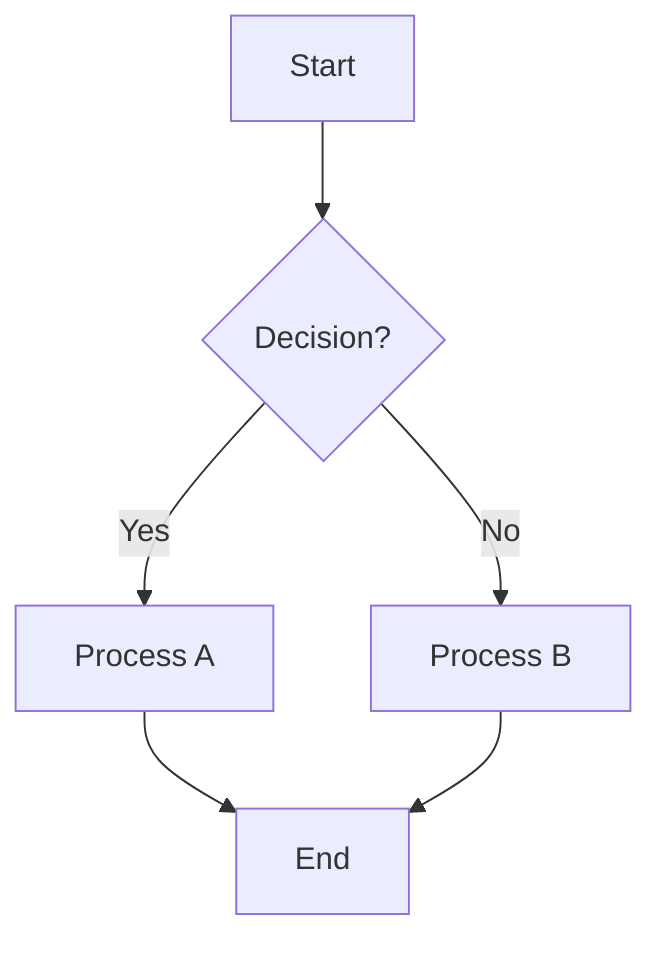
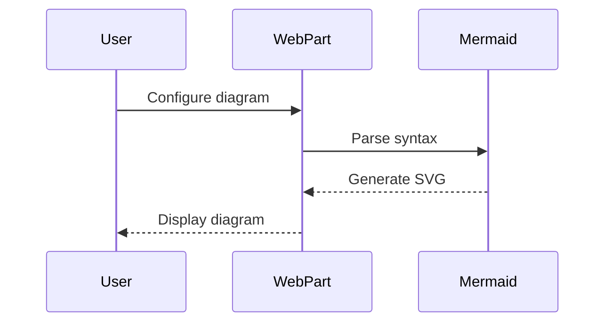
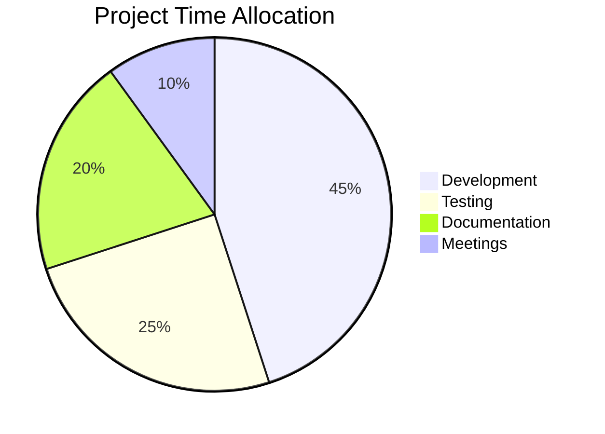
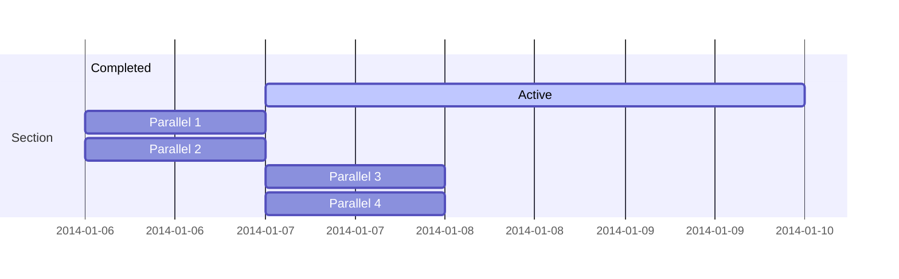
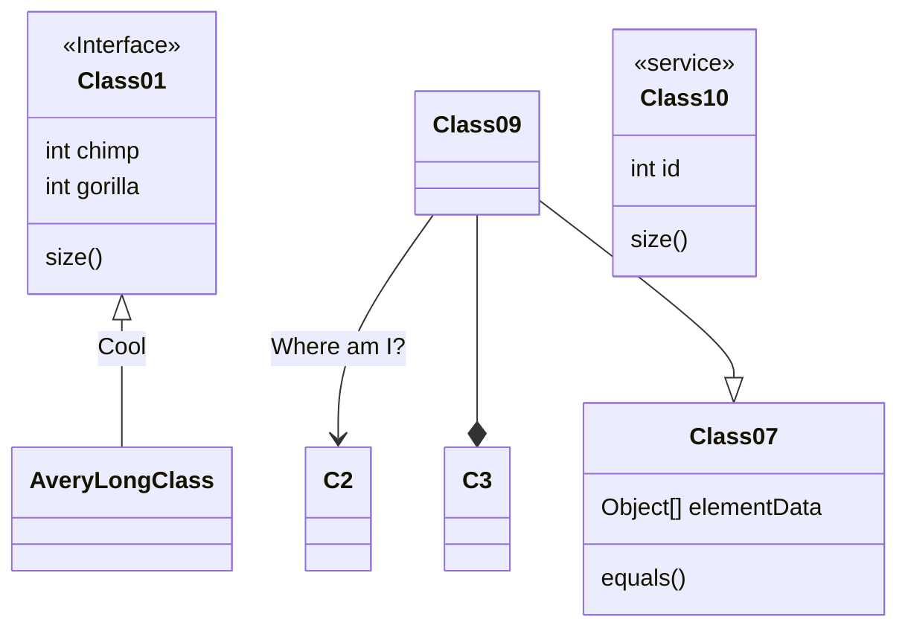
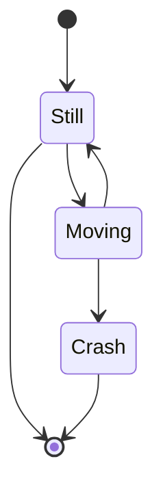

# mermaid-diagram

## Summary

This SharePoint Framework web part allows you to create and display Mermaid diagrams directly on SharePoint pages. Mermaid is a popular JavaScript-based diagramming and charting tool that renders markdown-inspired text definitions to create and modify diagrams dynamically.

The web part provides:
- **Visual Diagram Rendering**: Create flowcharts, sequence diagrams, Gantt charts, pie charts, and more using simple text syntax
- **Configurable Display Options**: Toggle title and border visibility through the property panel
- **Error Handling**: Graceful error display for invalid diagram syntax
- **Responsive Design**: Diagrams automatically scale to fit the container
- **Security**: Uses strict security level to prevent XSS attacks

### Sample Diagrams

#### Flowchart Example
**Mermaid Code:**
```
graph TD
    A[Start] --> B{Decision?}
    B -->|Yes| C[Process A]
    B -->|No| D[Process B]
    C --> E[End]
    D --> E
```

**Rendered Diagram:**


#### Sequence Diagram Example
**Mermaid Code:**
```
sequenceDiagram
    participant User
    participant WebPart
    participant Mermaid
    
    User->>WebPart: Configure diagram
    WebPart->>Mermaid: Parse syntax
    Mermaid-->>WebPart: Generate SVG
    WebPart-->>User: Display diagram
```

**Rendered Diagram:**


#### Pie Chart Example
**Mermaid Code:**
```
pie title Project Time Allocation
    "Development" : 45
    "Testing" : 25
    "Documentation" : 20
    "Meetings" : 10
```

**Rendered Diagram:**


#### Gantt Chart Example
**Mermaid Code:**
```
gantt
    section Section
    Completed :done,    des1, 2014-01-06,2014-01-08
    Active        :active,  des2, 2014-01-07, 3d
    Parallel 1   :         des3, after des1, 1d
    Parallel 2   :         des4, after des1, 1d
    Parallel 3   :         des5, after des3, 1d
    Parallel 4   :         des6, after des4, 1d
```

**Rendered Diagram:**


#### Class Diagram Example
**Mermaid code:**
```
classDiagram
Class01 <|-- AveryLongClass : Cool
<<Interface>> Class01
Class09 --> C2 : Where am I?
Class09 --* C3
Class09 --|> Class07
Class07 : equals()
Class07 : Object[] elementData
Class01 : size()
Class01 : int chimp
Class01 : int gorilla
class Class10 {
  <<service>>
  int id
  size()
}
```

**Rendered Diagram:**


#### State Diagram Example
**Mermaid code:**
```
stateDiagram-v2
[*] --> Still
Still --> [*]
Still --> Moving
Moving --> Still
Moving --> Crash
Crash --> [*]
```

**Rendered Diagram:**


## Used SharePoint Framework Version


## Applies to

- [SharePoint Framework](https://aka.ms/spfx)
- [Microsoft 365 tenant](https://docs.microsoft.com/sharepoint/dev/spfx/set-up-your-developer-tenant)

> Get your own free development tenant by subscribing to [Microsoft 365 developer program](http://aka.ms/o365devprogram)

## Prerequisites

> Any special pre-requisites?

## Solution

| Solution    | Author(s)                                               |
| ----------- | ------------------------------------------------------- |
| folder name | Author details (name, company, twitter alias with link) |

## Version history

| Version | Date             | Comments        |
| ------- | ---------------- | --------------- |
| 1.1     | March 10, 2021   | Update comment  |
| 1.0     | January 29, 2021 | Initial release |

## Disclaimer

**THIS CODE IS PROVIDED _AS IS_ WITHOUT WARRANTY OF ANY KIND, EITHER EXPRESS OR IMPLIED, INCLUDING ANY IMPLIED WARRANTIES OF FITNESS FOR A PARTICULAR PURPOSE, MERCHANTABILITY, OR NON-INFRINGEMENT.**

---

## Minimal Path to Awesome

- Clone this repository
- Ensure that you are at the solution folder
- in the command-line run:
  - `npm install -g @rushstack/heft`
  - `npm install`
  - `heft start`

> Include any additional steps as needed.

Other build commands can be listed using `heft --help`.

## Features

This SharePoint Framework web part demonstrates modern web part development with the following key features:

- **Mermaid.js Integration**: Seamless integration with the popular Mermaid diagramming library
- **Property Panel Configuration**: Easy-to-use property panel with:
  - Text field for web part title
  - Toggle to show/hide the title
  - Toggle to show/hide diagram border
  - Code editor for Mermaid diagram syntax with syntax highlighting
- **Responsive Design**: Diagrams automatically adapt to different screen sizes and container widths
- **Error Handling**: User-friendly error messages for invalid diagram syntax
- **Security Best Practices**: Implements strict security levels to prevent potential XSS attacks
- **Modern React Patterns**: Uses React hooks, TypeScript, and modern SPFx development practices
- **Fluent UI Integration**: Consistent styling with SharePoint's design system
- **Multiple Diagram Types Support**: Flowcharts, sequence diagrams, class diagrams, state diagrams, pie charts, Gantt charts, and more

This web part illustrates the following development concepts:

- SPFx web part development with React and TypeScript
- Third-party library integration in SharePoint Framework
- Custom property panel controls using PnP SPFx Property Controls
- Conditional rendering and dynamic CSS class assignment
- Async/await patterns for rendering operations
- Error boundary implementation for graceful error handling

> Notice that better pictures and documentation will increase the sample usage and the value you are providing for others. Thanks for your submissions advance.

> Share your web part with others through Microsoft 365 Patterns and Practices program to get visibility and exposure. More details on the community, open-source projects and other activities from http://aka.ms/m365pnp.

## References

- [Getting started with SharePoint Framework](https://docs.microsoft.com/sharepoint/dev/spfx/set-up-your-developer-tenant)
- [Building for Microsoft teams](https://docs.microsoft.com/sharepoint/dev/spfx/build-for-teams-overview)
- [Use Microsoft Graph in your solution](https://docs.microsoft.com/sharepoint/dev/spfx/web-parts/get-started/using-microsoft-graph-apis)
- [Publish SharePoint Framework applications to the Marketplace](https://docs.microsoft.com/sharepoint/dev/spfx/publish-to-marketplace-overview)
- [Microsoft 365 Patterns and Practices](https://aka.ms/m365pnp) - Guidance, tooling, samples and open-source controls for your Microsoft 365 development
- [Heft Documentation](https://heft.rushstack.io/)
- [Mermaid.js Documentation](https://mermaid.js.org/) - Official documentation for Mermaid diagramming syntax
- [PnP SPFx Property Controls](https://pnp.github.io/sp-dev-fx-property-controls/) - Property panel controls used in this web part
- [Mermaid Live Editor](https://mermaid.live/) - Online editor to test and create Mermaid diagrams